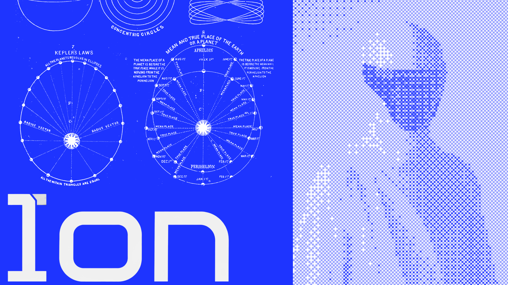

<div align="center">



# Ion

**一个持久的智能体。持久化记忆。有界执行。可见的证据。**

Ion 是来自 [MatrixMCL](https://matrixmcl.com) 的先进通用智能体 —— 一个具备加密记忆、
供应商中立模型执行，以及由操作者控制工具、项目、浏览器和专家智能体访问权限的单一持久身份。

[](https://github.com/paxlabs-inc/ion-agent/actions/workflows/ci.yml)
[](https://github.com/paxlabs-inc/ion-agent/actions/workflows/codeql.yml)
[](https://pkg.go.dev/github.com/paxlabs-inc/ion-agent)
[](https://goreportcard.com/report/github.com/paxlabs-inc/ion-agent)
[](LICENSE)
[](https://go.dev/)
[](CONTRIBUTING.md)
[](https://www.bestpractices.dev/)

[产品](https://ion.matrixmcl.com) ·
[文档](docs/) ·
[架构](ARCHITECTURE.md) ·
[安全](SECURITY.md) ·
[贡献](CONTRIBUTING.md) ·
[路线图](ROADMAP.md) ·
[讨论](https://github.com/paxlabs-inc/ion-agent/discussions)

[English](README.md) ·
**简体中文** ·
[Español](README.es.md) ·
[हिन्दी](README.hi.md) ·
[العربية](README.ar.md) ·
[Français](README.fr.md) ·
[Português](README.pt-BR.md)

</div>

---

> **预发布软件。** Web 操作者与核心运行时是主要的开发路径。终端客户端、受监督浏览器、
> Computer 以及 Software Studio 仍受
> [`spec/ion_spec/spec.kvx`](spec/ion_spec/spec.kvx) 中记录的验收边界约束。除非生产路径产生了
> 权威的结果证据，否则 Ion 不会声称某项操作成功。不可用的子系统会被投射为不可用，而非以
> 虚构数据表示。

## 目录

- [为什么选择 Ion](#为什么选择-ion)
- [特性](#特性)
- [架构](#架构)
- [快速开始](#快速开始)
  - [使用 Docker 运行](#使用-docker-运行)
  - [从源码构建](#从源码构建)
  - [开发容器](#开发容器)
- [初始化](#初始化)
- [运行](#运行)
- [配置](#配置)
- [部署](#部署)
- [项目结构](#项目结构)
- [开发](#开发)
- [测试与验证](#测试与验证)
- [安全](#安全)
- [路线图](#路线图)
- [社区与支持](#社区与支持)
- [贡献](#贡献)
- [许可证](#许可证)

## 为什么选择 Ion

大多数智能体框架都是一些库，你把它们组装进一个进程，而该进程在退出时会遗忘一切。Ion 恰恰相反：
它是一个**单一的持久运行时**，掌管身份、记忆、策略与证据，并将这一权威能力开放给轻量的
操作者客户端。

- **一个身份，而非众多会话。** Ion 是一个持久的行动者，具有连续的自我模型、持久化记忆以及
  稳定的审计轨迹 —— 而不是每次请求都从全新的上下文开始。
- **权威归属于运行时。** Go 运行时掌管策略、审批、幂等性（idempotency）与审计。Web 与终端
  客户端渲染的是一份生成的控制平面（control plane）协议，绝不臆造子系统状态。
- **证据优先于乐观假设。** 只有当真实的子系统产生了权威的结果证据、并且持久状态已写入之后，
  一项有后果的操作才会被报告为成功。不可用的能力会被显示为不可用。
- **设计上的供应商中立。** 模型执行被抽象在一个供应商层之后，具备显式、有序的回退（fallback）
  与凭据轮换。
- **有界的影响范围。** 专家子智能体获得受限范围的权限，绝不继承保险库（vault）密钥。浏览器与
  项目运行时是受监督的本地进程，其路径、端口、环境和接管租约（takeover lease）均有边界约束。

## 特性

| 能力 | 说明 |
|---|---|
| **加密记忆与会话** | 以行动者为范围、采用 AES-256-GCM 信封加密，具备 KEK → 用户密钥 → 每对象 DEK 的层级结构、原子轮换，以及关机时的密钥清零。 |
| **持久会话存储** | 纯 Go 实现的 SQLite，支持 WAL、单写入者队列、读取者池、带版本的内嵌迁移，以及由压缩触发的子会话。 |
| **供应商中立的执行** | 一个供应商无关的请求/生成/工具调用/流式模型，配有经校验的线路适配器，并在触发速率限制与失败时进行有序回退。 |
| **策略、审批与审计** | 有后果的工具会经过策略、人工审批、幂等性与审计边界。不存在泛化的“仅接受”式变更响应。 |
| **持久工作与调度** | 工作跟踪、调度与恢复可在重启后存续；任务生命周期与操作者的连接状态解耦。 |
| **有界的专家智能体** | 一个由受限范围子智能体组成的注册表，具有有界的生命周期，且绝不继承保险库（vault）密钥。 |
| **受监督浏览器** | 通过 Chrome DevTools Protocol 驱动的 Chromium 会话，处于 SSRF 与私有网络控制之下。 |
| **向量检索** | 一个可选的 Rust HNSW 边车（sidecar），用于高召回率的相似度搜索。 |
| **Web 操作者** | 一个 React 操作者，提供聊天、审批、会话、供应商、记忆、安全、项目、Computer 以及 Software Studio 的投射视图。 |
| **终端操作者** | 一个内嵌的 React Ink 终端客户端，用于本地挂接与受监督运行。 |
| **生成的协议** | 单一的 Go 控制平面目录生成供每个操作者使用的共享 TypeScript 客户端；CI 会拒绝任何漂移（drift）。 |

## 架构

```text
Web operator ─┐
              ├─ authenticated control plane ─ agent runtime ─ providers
Terminal UI ──┘                │                    │
                               │                    ├─ policy-bound tools
                               │                    ├─ supervised projects/browser
                               │                    └─ bounded specialist agents
                               │
                               └─ encrypted session, memory, audit, and work state
```

默认部署是一个单一的本地 `ion` 进程。纯 HTTP 仅限于环回（loopback）；远程访问需要一个由操作者
管理的 TLS 反向代理。

权威与执行遵循同一条路径：

1. 一个经过身份验证的行动者提交控制平面请求。
2. 操作者应用解析出行动者、会话、通道、配置档（profile）与审批上下文。
3. 有后果的操作会经过策略、审批、幂等性与审计。
4. 运行时执行真实的子系统实现。
5. 在投射成功**之前**，持久状态与证据先行写入。
6. 客户端渲染所得到的状态，包括显式的不可用与部分完成的结果。

完整设计请参见 [ARCHITECTURE.md](ARCHITECTURE.md)。

## 快速开始

### 使用 Docker 运行

在本地尝试 Ion 的最快方式。操作者默认仅限环回（loopback）。

```bash
git clone https://github.com/paxlabs-inc/ion-agent.git
cd ion-agent

# Build the image and start the web operator on http://127.0.0.1:4174
docker compose -f docker/docker-compose.yml up --build
```

打开 <http://127.0.0.1:4174>。有关镜像变体、卷与环境变量，请参见
[docker/README.md](docker/README.md)。

### 从源码构建

**依赖要求**

| 工具 | 版本 |
|---|---|
| Go | 1.26.5 |
| Node.js | 22.22+ (Node 22 line) |
| npm | 11 |
| Rust | 1.78.0 (optional HNSW service) |
| Chromium | for native browser acceptance tests |

```bash
git clone https://github.com/paxlabs-inc/ion-agent.git
cd ion-agent

make build
```

发布构建会将确定性的 web 与终端产物内嵌到 `bin/ion` 中。

### 开发容器

[`.devcontainer/`](.devcontainer/) 下提供了一个即开即用的开发环境，预装了 Go、Node、Rust 与
Chromium。在 VS Code 中，运行 **Dev Containers: Reopen in Container**，或使用 GitHub Codespaces
按钮。从 `make build` 到 `make ci` 的一切都可开箱即用。

## 初始化

生产环境的初始化使用宿主机受保护的密钥源：

```bash
./bin/ion init
```

对于没有受支持的受保护密钥源的无头（headless）开发环境，可以显式选择仅供开发使用的文件 KEK：

```bash
./bin/ion init --dev-file-kek
```

> 该开发回退机制**绝不能**用作生产部署方式。

## 运行

```bash
# Web operator (http://127.0.0.1:4174 by default)
./bin/ion dashboard

# Terminal operator with a supervised local runtime
./bin/ion tui

# Attach the terminal operator to an existing dashboard runtime
./bin/ion tui --attach

# Print version, commit, and build metadata
./bin/ion version
```

纯 HTTP 仅限环回（loopback）。远程访问需要一个由操作者管理的 TLS 反向代理。

## 配置

Ion 从命令行标志与环境变量读取其数据目录、监听地址和密钥源。最常用的配置项：

| 标志 / 环境变量 | 默认值 | 说明 |
|---|---|---|
| `--data-dir` / `ION_DATA_DIR` | `~/.ion` | 持久数据目录（SQLite、保险库、工作状态）。 |
| `--listen` / `ION_WEB_LISTEN` | `127.0.0.1:4174` | Web 操作者监听地址。仅绑定至环回。 |
| `--dev-file-kek` | off | 仅供开发使用的文件 KEK。切勿在生产环境使用。 |

完整参考请参见 [docs/configuration.md](docs/configuration.md)。

## 部署

Ion 在 [`deploy/`](deploy/) 下提供了面向生产的部署资产：

- **Docker Compose** —— [`deploy/compose/`](deploy/compose/)，用于置于 TLS 反向代理之后的
  单主机操作者。
- **Kubernetes** —— [`deploy/kubernetes/`](deploy/kubernetes/) 清单（命名空间、部署、服务、
  配置、入口），并附带一个 Kustomize base。
- **Helm** —— [`deploy/helm/ion/`](deploy/helm/ion/) chart，用于参数化安装。
- **systemd** —— [`deploy/systemd/`](deploy/systemd/) unit，用于裸金属主机。

在将 Ion 暴露到环回之外以前，请先阅读 [docs/deployment.md](docs/deployment.md) 与
[deploy/README.md](deploy/README.md)。TLS 终结、密钥源与网络出口控制均属操作者的职责。

## 项目结构

```text
cmd/ion/                 CLI and runtime entry point
cmd/ion-web-e2e/         build-tagged browser acceptance helper
internal/agent/          provider/tool turn loop
internal/controlplane/   generated client contract and transports
internal/operatorapp/    production capability wiring and projections
internal/security/       vault, policy, sandbox, SSRF, and safety controls
internal/session/        encrypted durable session state
internal/memory/         journal, integrity, retrieval, and Cortex services
internal/project/        workspace, terminal, Git, runtime, and preview control
internal/browser/        supervised Chromium sessions
internal/swarm/          bounded specialist-agent registry and lifecycle
internal/tools/          policy-bound tool manager and lifecycle
internal/work/           durable work tracking
internal/scheduler/      durable scheduled work
ui/shared/               generated protocol types and client
ui/web/                  React web operator
ui/tui/                  embedded terminal operator
hnsw-service/            Rust vector-search sidecar
migrations/              embedded SQLite migrations
spec/ion_spec/           authoritative product specification
deploy/                  Kubernetes, Helm, Compose, and systemd assets
docker/                  container image and local Compose stack
tests/                   integration, adversarial, and clean-install acceptance
```

## 开发

```bash
make build          # Build the operator release (web + TUI + Go binary)
make build-all      # Also build the Rust HNSW sidecar
make run            # Build and run the web operator
make dev            # Auto-rebuild on change (air)
make fmt tidy       # Format and tidy
make help           # List every target
```

在你提交 PR 之前值得了解的一些内部准则：

- 交付完整、可运行的产物 —— 而非 diff。
- 除真正的外部边界外，不使用桩（stub）、模拟（mock）或伪造实现（fake）。
- 客户端 UI 通过背景色对比来区分层次，绝不使用边框描边。
- UI 或输出中不使用表情符号、紫色渐变或发光效果。

请参见 [CONTRIBUTING.md](CONTRIBUTING.md) 与
[`spec/ion_spec/ENGINEERING_STANDARDS.md`](spec/ion_spec/ENGINEERING_STANDARDS.md)。

## 测试与验证

```bash
make test-unit        # Unit tests with the race detector
make vet              # go vet
make verify-deps      # Verify checksummed Go and Rust dependencies
make test-operator    # Shared, web, TUI, browser, accessibility, and budget gates
make spec-validate    # Validate the authoritative spec.kvx
make ci               # Full CI pipeline
```

CI 会在每一次推送与拉取请求上，跨 Go、Rust 与操作者客户端运行同样的关卡，并拒绝生成契约与
文档的漂移（drift）。请参见 [`.github/workflows/`](.github/workflows/)。

## 安全

Ion 是一个具备自主行动能力的持续在场智能体，其安全模型被视为一等的产品面：八类对手、明确定义的
核心资产（crown-jewel assets），以及具约束力的安全架构决策（SADR）。子智能体绝不继承保险库
（vault）密钥，空闲期主体（idle-time principal）无法执行高风险或对外操作，且所有安全覆盖
（safety override）都会被记录并对用户可见。

**请勿在公开 issue 中报告漏洞。** 请使用
[GitHub 私密漏洞报告](https://github.com/paxlabs-inc/ion-agent/security/advisories/new)，
并遵循 [SECURITY.md](SECURITY.md) 中的流程。

## 路线图

权威的计划与任务状态位于
[`spec/ion_spec/spec.kvx`](spec/ion_spec/spec.kvx)。一份可读的摘要维护在
[ROADMAP.md](ROADMAP.md) 中。生成的摘要属信息性投射，而非权威的任务台账。

## 社区与支持

- **问题与想法** —— [GitHub Discussions](https://github.com/paxlabs-inc/ion-agent/discussions)
- **缺陷与功能** —— [GitHub Issues](https://github.com/paxlabs-inc/ion-agent/issues)
- **如何获取帮助** —— [SUPPORT.md](SUPPORT.md)
- **社区规范** —— [CODE_OF_CONDUCT.md](CODE_OF_CONDUCT.md)
- **项目治理** —— [GOVERNANCE.md](GOVERNANCE.md)

## 贡献

欢迎贡献。请阅读 [CONTRIBUTING.md](CONTRIBUTING.md)，认领一个 issue，并提交一个聚焦的拉取请求。
所有贡献者都应遵循[行为准则](CODE_OF_CONDUCT.md)。

## 许可证

Ion 是自由开源软件，依据 [MIT 许可证](LICENSE)授权。

<div align="center">

版权所有 © 2026 MatrixMCL —— <a href="https://ion.matrixmcl.com">ion.matrixmcl.com</a>

</div>
